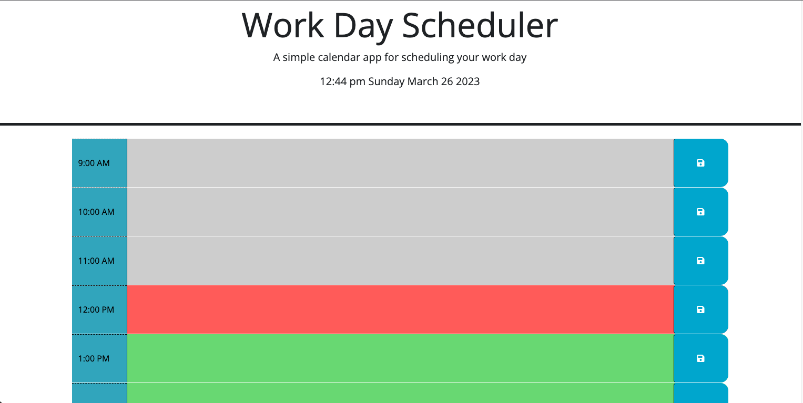

# work-day-scheduler

## Description

Site URL: https://jtpheonix13.github.io/work-day-scheduler/

The task was to create a work day scheduler that showed the typical workday.

### Function
The work day scheduler had several requirements.
1. The current hour would have an orange background.
2. Hours ahead would have a green background.
3. Hours past would be grey.
4. Tasks can be added to each hour block and saved to local storage.
5. Upon page reload any saved tasked would be retrieved from local storage and displayed in the appropriate time block.

### Technologies used
1. HTML
2. Javascript
3. CSS
4. Jquery
5. day.js

### Site Screenshot

